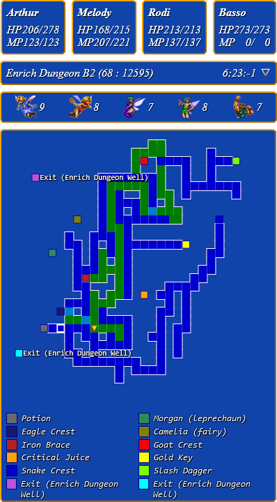

# Shining The Holy Ark Auto Mapper

This is a __*very alpha-state*__ auto mapper for Camelot's "Shining the Holy Ark" game for Sega Saturn. 
It should work "out of the box" for RALibRetro emulator with Beetle Saturn (mednafen) core released within past couple years (as of 29th of September, 2024).

> For RetroArch (Kronos core) see the [RetroArch](/tree/RetroArch) branch. 
> *Note, I offer no support for it.* 
> No builds are planned for it and no easy way to launch that version of this app exists. 
> However, pull requests are as welcome as for the main branch.

The app "attaches" itself to the emulator's process, reads memory while the game still runs, and displays data in a browser window.

## Why?

The game can map those pesky maps on its own, so... why?
Reasons:
 - in-game maps don't show treasures
 - in-game maps most of the time don't show obstacles
 - to see the the map and stats in-game one has to press a couple of buttons
 - it was fun!

## What can it do?
So far it's capable of:
- Displaying the World Map (including your current location)
- Displaying current party members' current and max HP/MP
- Properly reading your character's name
- Mapping dungeons with distinct colors for various floor and ceiling elevation levels
- Mapping cities (something the game doesn't do for you)
- Showing the name of the map you're on (including internal IDs)
- Showing player's current X, Y, and Z coordinates (rounded)
- Showing the direction player's looking in
- Showing treasures' locations and a legend (incomplete)
- Showing exits/stairs (incomplete)
- Counting collected fairies

## How to run

### The `user` way
- Go to [releases](releases) and download the latest `release.zip` file
- Unpack to wherever you'd like
- Delete `maps.json` if you don't need the included map data
- Run the `sthaam.exe`

### The `tech savvy` way
- Download UI from [here](archive/refs/heads/master.zip)
- Unpack UI to wherever you'd like
- Delete `maps.json` if you don't need the included map data
- Go to [releases](releases) and download the latest executable
- Place it in the same folder as ui.html
- Run the `sthaam.exe`

### The `dev` way
(The only way to adjust everything and anything. Might be needed to use with other cores/front ends)
- Get NodeJS from it's [official site](https://nodejs.org/en)
- Clone this repo
- `cd` into the repo 
- Install dependencies `npm install`
- Delete `maps.json` if you don't need the included map data
- Run it `node index.js`

## Thanks

- [fbparis](https://mokole.com/palette.html) for distinct colors generator
- [Wolfgang Archive](http://wolfgangarchive.com/stha-web) for inaccurate but very helpful maps
- [Alfex](https://retroachievements.org/user/Alfex) initial StHA cheevo dev
- [Ghal416](https://retroachievements.org/user/Ghal416) StHA set revision dev
- [Cheat Engine](https://cheatengine.org) for memory inspection tools
- [Sega Retro](https://segaretro.org/Shining_the_Holy_Ark) for item images (yet unused)
- [Hitomi](https://github.com/hitomi2500/ss-save-parser) for the Saturn Backup RAM Parser
- [RikaPSO](https://forums.shiningforcecentral.com/memberlist.php?mode=viewprofile&u=31411&sid=ab3f5f3c1e09ef9fd4c9276c5a100a0b) for the save files (included in this repo)

