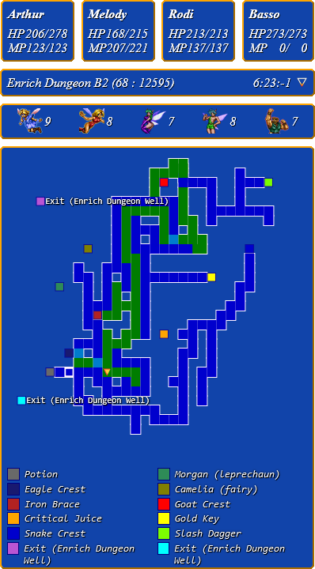

# Shining The Holy Ark Auto Mapper

This is a __*alpha-state*__ auto mapper for Camelot's "Shining the Holy Ark" game for Sega Saturn. 
It should work "out of the box" for RALibRetro and retroarch emulators with Beetle Saturn (mednafen) or Kronos cores (any combination of the four) released within past couple years (as of 20th of December, 2024).

 *The support fro Kronos has been merged into the main index.j script on 21th of December, 2024*. 
> *Note, I offer no support for Kronos core* as yabause's memory mapping is too finicky. 
> However, since the core and emulator are under autodetect now, there's abuild for it. 
> Pull requests are as welcome for any core/emulator.

## How?

The app "attaches" itself to the emulator's process, reads memory while the game still runs, and displays data in a browser window using websockets. 
There's no need for a webserver, just open the ui.html in any browser (or OBS browser source).

By default the colors are like this:  

## Why?

The game can map those pesky maps on its own, so... why?
Reasons:
 - in-game maps don't show treasures
 - in-game maps most of the time don't show obstacles
 - to see the the map and stats in-game one has to press a couple of buttons
 - it was fun!

## What can it do?
So far it's capable of:
- Displaying the World Map (including your current location)
- Displaying current party members' current and max HP/MP
- Adjusting window and frame colors based of your ing-game settings (needs customization window to be opened at least once per session)
- Properly reading your character's name
- Mapping dungeons with distinct colors for various floor and ceiling elevation levels
- Mapping cities (something the game doesn't do for you)
- Showing the name of the map you're on (including internal IDs)
- Showing player's current X, Y, and Z coordinates (rounded)
- Showing the direction player's looking in
- Showing treasures' locations and a legend (incomplete)
- Showing exits/stairs (incomplete)
- Counting collected fairies

## How to run

### The `user` way
- Go to [releases](releases) and download the latest `release.zip` file
- Unpack to wherever you'd like
- Delete `maps.json` if you don't need the included map data
- Run the `sthaam.exe`

### The `tech savvy` way
- Download UI from [here](archive/refs/heads/master.zip)
- Unpack UI to wherever you'd like
- Delete `maps.json` if you don't need the included map data
- Go to [releases](releases) and download the latest executable
- Place it in the same folder as ui.html
- Run the `sthaam.exe`

### The `dev` way
(The only way to adjust everything and anything. The only way to use this mapper with the Kronos core and possible other front-ends)
- Get NodeJS from it's [official site](https://nodejs.org/en)
- Clone this repo
- `cd` into the repo 
- Install dependencies `npm install`
- Delete `maps.json` if you don't need the included map data
- Run it `node index.js` 

## Thanks

- [fbparis](https://mokole.com/palette.html) for distinct colors generator
- [Wolfgang Archive](http://wolfgangarchive.com/stha-web) for inaccurate but very helpful maps
- [Alfex](https://retroachievements.org/user/Alfex) initial StHA cheevo dev
- [Ghal416](https://retroachievements.org/user/Ghal416) StHA set revision dev
- [Cheat Engine](https://cheatengine.org) for memory inspection tools
- [Sega Retro](https://segaretro.org/Shining_the_Holy_Ark) for item images (yet unused)
- [Hitomi](https://github.com/hitomi2500/ss-save-parser) for the Saturn Backup RAM Parser
- [RikaPSO](https://forums.shiningforcecentral.com/memberlist.php?mode=viewprofile&u=31411&sid=ab3f5f3c1e09ef9fd4c9276c5a100a0b) for the save files (included in this repo)

